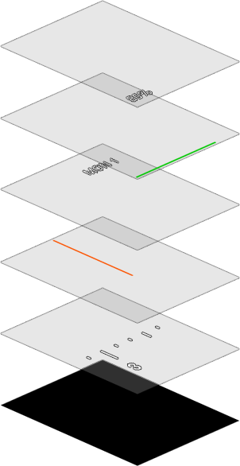
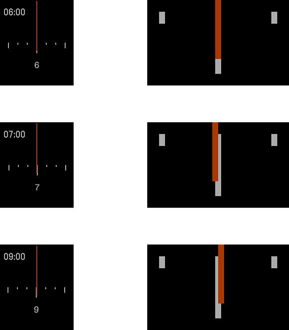
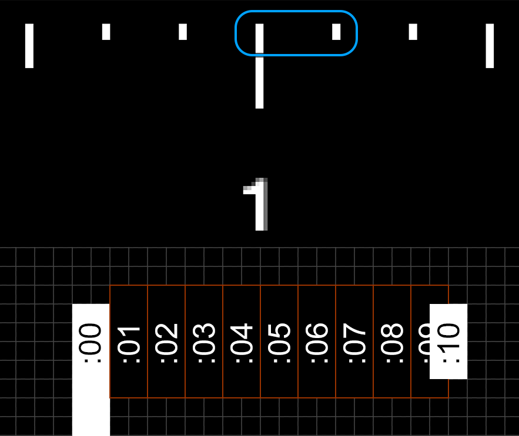
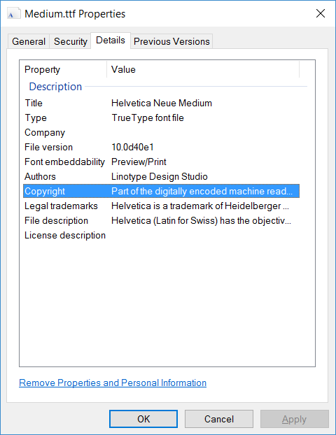
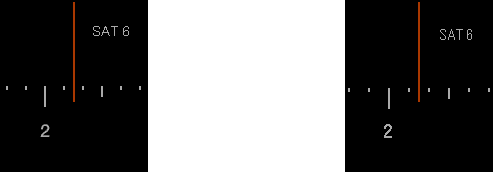
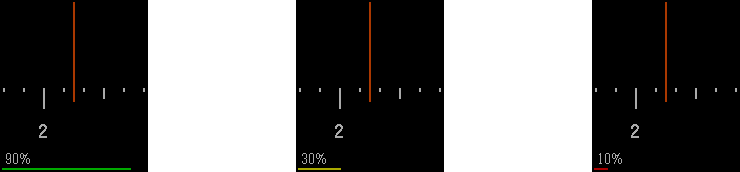
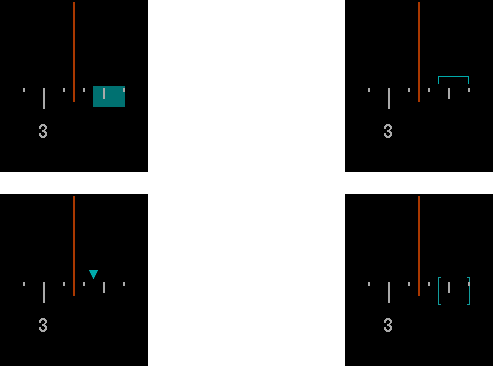

# Dial Plus


A [Pebble](https://www.pebble.com) watchface based on [Priyesh Patel's](http://priyesh.me/) superb watchface Dial ([source](https://github.com/ItsPriyesh/Dial), [Pebble appstore](https://apps.getpebble.com/en_US/application/56512a8ba69d971f08000038)).

<p align="center" style="text-align: center">

</p>

Dial Plus shows the time simply. When you flick your wrist, battery information and the date appear.

Here are the five logical [layer](https://developer.pebble.com/docs/c/User_Interface/Layers/)s expanded. From top to bottom: battery percent, battery bar, date, needle, dial, background.

<p align="center" style="text-align: center">

</p>

## Issues addressed

The original Dial is my favorite watchface. I only found a few small things to improve upon.

### Clock alignment

After 6:00pm, the needle doesn't line up correctly with the ticks on the dial.

In the screenshots below, the entire watchface is shown on the left and a zoomed-in region around the needle is shown on the right. The digital clocks are the watchface itself drawing what time it thinks it is; I did not add them after taking the screenshots.

<p align="center" style="text-align: center">

</p>

The original Dial has a  single [background image](https://github.com/ItsPriyesh/Dial/blob/master/resources/background.png) with numbers from 1 to 12, which is positioned so the needle points to the correct time.

There are 10 minutes between any two adjacent ticks. Both the needle and the ticks are 2 pixels wide, so there should be 20 pixels between ticks.

But the ticks are 1 pixel too close to each other. In the picture below, I zoom on two adjacent ticks, show the pixel grid, and illustrate where the needle should be at 1:00 through 1:10. As you can see, there's not enough room.

<p align="center" style="text-align: center">

</p>


I believe a secondary problem involves integer division. Here's Priyesh's [code](https://github.com/ItsPriyesh/Dial/blob/master/src/Dial.c#L56-L59) to compute the offset of the background image:

```
static void draw_clock(struct tm *tick_time) {
    ...
    const int64_t background_x_offset = mins_since_midnight * BACKGROUND_WIDTH * 2 / mins_in_day;
    ...
```
The background image goes from 0 to 12 hours, so twice the background width is 24 hours. Consequently, the term `BACKGROUND_WIDTH * 2 / mins_in_day`  equals the number of pixels per minute.

Both he ticks and the needle are 2 pixels wide, so the number of pixels per minute should be exactly 2. `BACKGROUND_WIDTH` is [1366 pixels](https://github.com/ItsPriyesh/Dial/blob/master/src/Dial.c#L3), so

```
  BACKGROUND_WIDTH * 2 / mins_in_day
= 1366 * 2 / 1440
= 1.897222
```
which is not 2. The Pebble's hardware cannot do floating point numbers.


### Font licence

The original font, [`Medium.ttf`](https://github.com/ItsPriyesh/Dial/blob/master/resources/Medium.ttf), is [Helvetica Neue](https://www.linotype.com/1245395/neue-helvetica-family.html), which is not free. The file even has multiple fields of copyright metadata intact:

<p align="center" style="text-align: center">

</p>


The embedded copyright text is so amazingly long I have included it here.
 
>Part of the digitally encoded machine readable outline data for producing the Typefaces provided is  copyrighted © 2003 - 2006 Linotype GmbH, www.linotype.com. All rights reserved. This software is  the property of Linotype GmbH, and may not be reproduced, modified, disclosed or transferred without the express written approval of Linotype GmbH. Copyright © 1988, 1990, 1993 Adobe Systems Incorporated. All Rights Reserved. Helvetica is a trademark of Heidelberger Druckmaschinen AG, exclusively licensed through Linotype GmbH, and may be registered in certain jurisdictions. This typeface is original artwork of Linotype Design Studio. The design may be protected in certain jurisdictions.

(Also, it was very hard to get Windows to let me copy the copyright string. I had to use the [`Get-FileMetaData`](https://gallery.technet.microsoft.com/scriptcenter/get-file-meta-data-function-f9e8d804) PowerShell script script by IamMred from the Microsoft Script Center Repository.)

I replaced Helvetica Neue with [Raster Gothic](https://developer.pebble.com/guides/app-resources/system-fonts/#raster-gothic) from the Pebble SDK.

Below, Helvetica Neue is on the left and Raster Gothic is on the right.

<p align="center" style="text-align: center">

</p>

## Features added

### Battery display

When you shake your wrist, Dial Plus displays the battery percentage and a colored bar. 

<p align="center" style="text-align: center">

</p>

Strangely, the API only exposes battery percentage in 10% increments.

### Calendar events (incomplete)

I want to show upcoming Google Calendar events on the dial, using one of these styles:

<p align="center" style="text-align: center">

</p>


I know this is possible without a companion app because [My Calendar](https://apps.getpebble.com/en_US/application/5425871e2375286a35000124?dev_settings=1) by Stanfy and [Calendar Cards](http://apps.getpebble.com/en_US/application/55ad0a036749cdddc6000075?dev_settings=1) by Ester Sanchez both do it.

It turns out it's a real pain in the ass. I would need to write the interaction with Google's calendar API from scratch. There are [at least](https://github.com/pebble/slate) [two](https://developer.pebble.com/blog/2016/06/24/introducing-clay/) frameworks for doing watchface configuration, both poorly documented and neither supported by CloudPebble (the online SDK).  There are not enough other libraries to make it worthwhile.

### Organization

All the code was originally in a single 149-line file, [`Dial.c`](https://github.com/ItsPriyesh/Dial/blob/master/src/Dial.c), which was a bit hard to read.

Since I added a lot of functionality, I split it up into files for [`main`](https://github.com/pfroud/DialPlus/blob/master/src/main.c), [`drawing`](https://github.com/pfroud/DialPlus/blob/master/src/drawing.c), [`animation`](https://github.com/pfroud/DialPlus/blob/master/src/animation.c), and [`handlers`](https://github.com/pfroud/DialPlus/blob/master/src/handlers.c).


&nbsp;

*The top picture of the Pebble Time Steel in Silver from the [Pebble store](https://www.pebble.com/buy-pebble-time-steel-smartwatch).*
