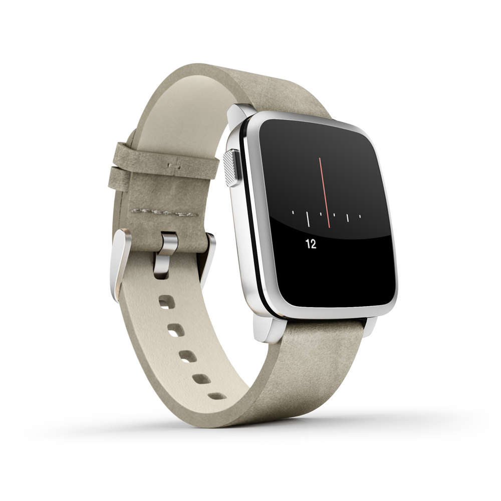
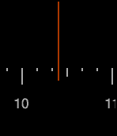
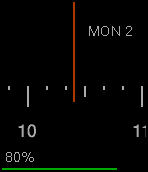

Dial Plus
====

A [Pebble](https://www.pebble.com) watchface based on [Priyesh Patel's](http://priyesh.me/) Dial watchface ([source](https://github.com/ItsPriyesh/Dial), [appstore](https://apps.getpebble.com/en_US/application/56512a8ba69d971f08000038)).

I have added battery information on shake, and am going to try to add indicators for calendar events.

<!-- Some next-level html spacing right here -->
&emsp;&emsp;&emsp;&emsp;&emsp;&emsp;&emsp;&emsp;&emsp;&emsp;&emsp;&emsp;&emsp;&emsp;&emsp;&emsp;

 

Idle
<!-- Just go with it okay -->
&emsp;&emsp;&emsp;&emsp;&emsp;&emsp;&emsp;&emsp;&emsp;&emsp;&emsp;&emsp;&emsp;&emsp;&emsp;&emsp;&emsp;&emsp;&emsp;&emsp;&emsp;&emsp;&emsp;&emsp;
Flick

